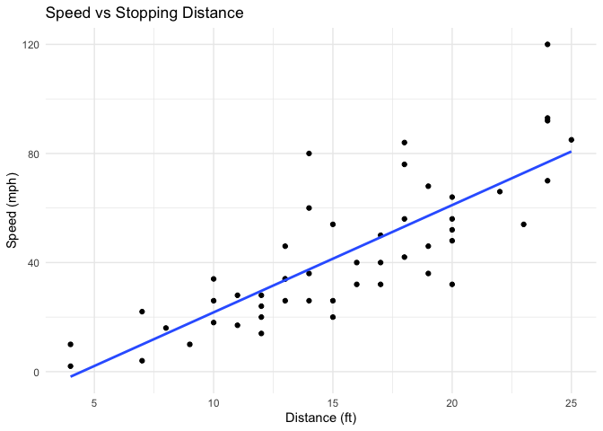
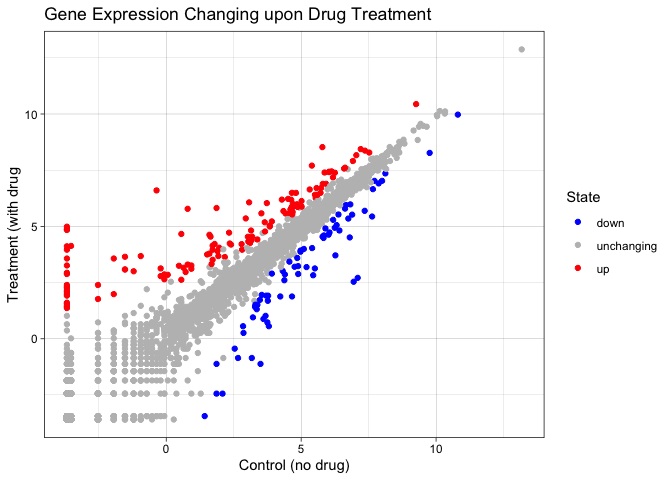
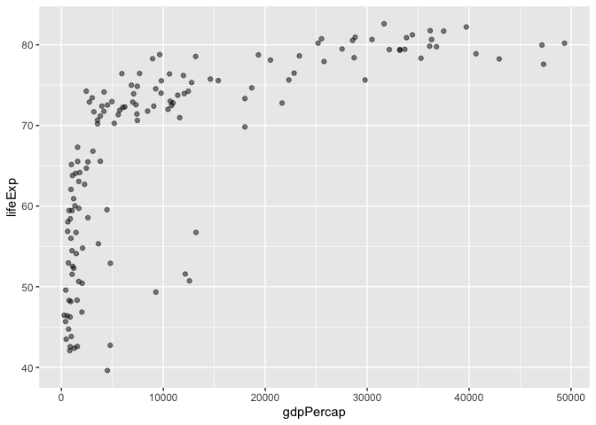
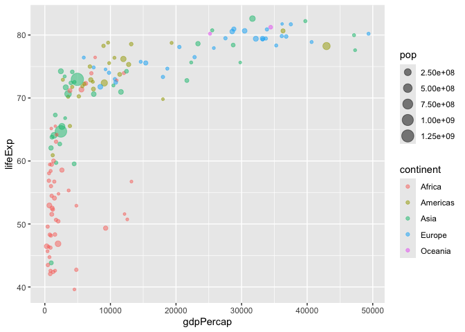
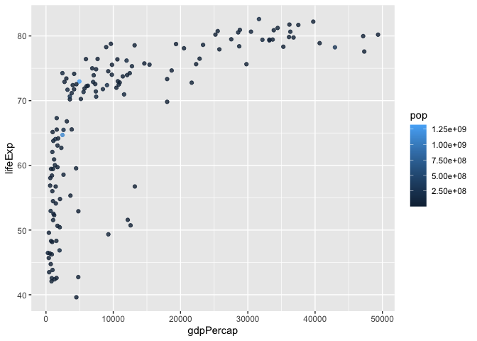
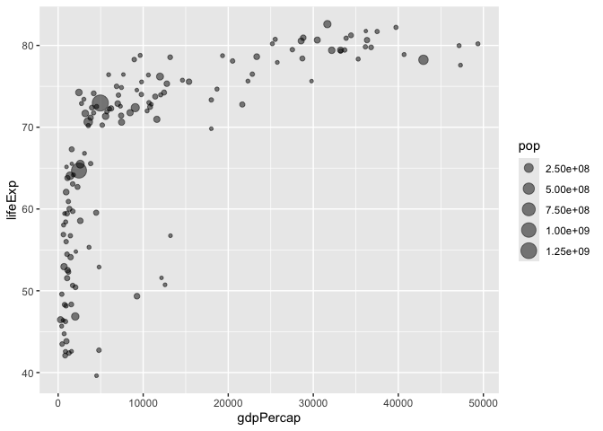
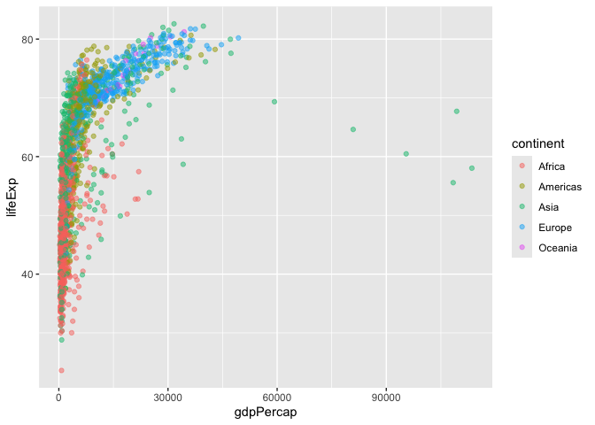
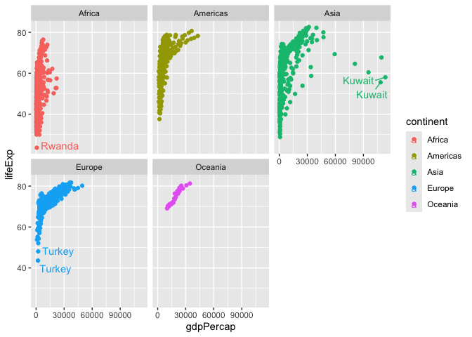

# Lab 5: Data Visualization with ggplot
Tusha (A17339806)

Today we are exploring the **ggplot** package and how to use it for data
visualization. Other ways in which figures and plots can be made in R
are:

- “base” R
- other such add-on packages

“base” R plot

``` r
plot(cars)
```


> Key point: “base” R is quick but not aesthetic

ggplot

``` r
library(ggplot2)
ggplot(cars)
```


Every ggplot is composed of at least 3 layers:

- data (df with everything we want to plot)
- aesthetics
- geometry (includes the types of plot i.e. dot, column, etc.)

``` r
ggplot(cars) +
  aes(x=speed, y=dist) +
  geom_point() +
  geom_smooth(method=lm, se=FALSE) +
  labs(title="Speed vs Stopping Distance", x="Distance (ft)", y="Speed (mph)") +
  theme_minimal()
```

    `geom_smooth()` using formula = 'y ~ x'



> Key point: For simple “canned” graphs, “base” R is quicker and the
> code is more concise. As things get more elaborate, ggplot is better
> to make custom graphs with.

More elaborate plots

``` r
url <- "https://bioboot.github.io/bimm143_S20/class-material/up_down_expression.txt"
genes <- read.delim(url)
head(genes)
```

            Gene Condition1 Condition2      State
    1      A4GNT -3.6808610 -3.4401355 unchanging
    2       AAAS  4.5479580  4.3864126 unchanging
    3      AASDH  3.7190695  3.4787276 unchanging
    4       AATF  5.0784720  5.0151916 unchanging
    5       AATK  0.4711421  0.5598642 unchanging
    6 AB015752.4 -3.6808610 -3.5921390 unchanging

> How many genes are in this dataset?

5196

> How many upregulated genes are there?

127

``` r
nrow(genes)
```

    [1] 5196

``` r
sum(genes$State=="up")
```

    [1] 127

``` r
table(genes$State)
```


          down unchanging         up 
            72       4997        127 

``` r
ggplot(data=genes) +
  aes(x=Condition1, y=Condition2, col=State) +
  geom_point() +
  scale_colour_manual( values=c("blue","gray","red") ) +
  labs(title="Gene Expression Changing upon Drug Treatment", x="Control (no drug)", y="Treatment (with drug") +
  theme_linedraw()
```



### More Plotting

``` r
url <- "https://raw.githubusercontent.com/jennybc/gapminder/master/inst/extdata/gapminder.tsv"
gapminder <- read.delim(url)
```

``` r
library(dplyr)
```


    Attaching package: 'dplyr'

    The following objects are masked from 'package:stats':

        filter, lag

    The following objects are masked from 'package:base':

        intersect, setdiff, setequal, union

``` r
gapminder_2007 <- gapminder %>% filter(year==2007)
head(gapminder_2007)
```

          country continent year lifeExp      pop  gdpPercap
    1 Afghanistan      Asia 2007  43.828 31889923   974.5803
    2     Albania    Europe 2007  76.423  3600523  5937.0295
    3     Algeria    Africa 2007  72.301 33333216  6223.3675
    4      Angola    Africa 2007  42.731 12420476  4797.2313
    5   Argentina  Americas 2007  75.320 40301927 12779.3796
    6   Australia   Oceania 2007  81.235 20434176 34435.3674

To plot it,

``` r
ggplot(gapminder_2007) +
  aes(x=gdpPercap, y=lifeExp) +
  geom_point(alpha=0.5)
```



``` r
# alpha makes the dots more transparent
```

> How many countries are in this dataset?

142

> How many continents are in this dataset?

5

``` r
length(table(gapminder$country))
```

    [1] 142

``` r
length(table(gapminder$continent))
```

    [1] 5

``` r
ggplot(gapminder_2007) +
  aes(x=gdpPercap, y=lifeExp, color=continent, size=pop) +
  geom_point(alpha=0.5)
```



``` r
ggplot(gapminder_2007) + 
  aes(x = gdpPercap, y = lifeExp, color = pop) +
  geom_point(alpha=0.8)
```



``` r
ggplot(gapminder_2007) + 
  aes(x = gdpPercap, y = lifeExp, size = pop) +
  geom_point(alpha=0.5)
```



``` r
ggplot(gapminder_2007) + 
  geom_point(aes(x = gdpPercap, y = lifeExp,
                 size = pop), alpha=0.5) + 
  scale_size_area(max_size = 10)
```


``` r
ggplot(gapminder) +
  aes(x=gdpPercap, y=lifeExp, col=continent) +
  geom_point(alpha=0.5)
```



``` r
kuw <- gapminder %>% filter(country=="Kuwait")
kuw
```

       country continent year lifeExp     pop gdpPercap
    1   Kuwait      Asia 1952  55.565  160000 108382.35
    2   Kuwait      Asia 1957  58.033  212846 113523.13
    3   Kuwait      Asia 1962  60.470  358266  95458.11
    4   Kuwait      Asia 1967  64.624  575003  80894.88
    5   Kuwait      Asia 1972  67.712  841934 109347.87
    6   Kuwait      Asia 1977  69.343 1140357  59265.48
    7   Kuwait      Asia 1982  71.309 1497494  31354.04
    8   Kuwait      Asia 1987  74.174 1891487  28118.43
    9   Kuwait      Asia 1992  75.190 1418095  34932.92
    10  Kuwait      Asia 1997  76.156 1765345  40300.62
    11  Kuwait      Asia 2002  76.904 2111561  35110.11
    12  Kuwait      Asia 2007  77.588 2505559  47306.99

``` r
ggplot(gapminder) + 
  aes(x = gdpPercap, y = lifeExp, col = continent, label = country) +
  geom_point() + 
  facet_wrap(~continent)
```


``` r
library(ggrepel)
ggplot(gapminder) + 
  aes(x = gdpPercap, y = lifeExp, col = continent, label = country) +
  geom_point() + 
  geom_text_repel() +
  facet_wrap(~continent)
```

    Warning: ggrepel: 623 unlabeled data points (too many overlaps). Consider
    increasing max.overlaps

    Warning: ggrepel: 358 unlabeled data points (too many overlaps). Consider
    increasing max.overlaps

    Warning: ggrepel: 300 unlabeled data points (too many overlaps). Consider
    increasing max.overlaps

    Warning: ggrepel: 24 unlabeled data points (too many overlaps). Consider
    increasing max.overlaps

    Warning: ggrepel: 394 unlabeled data points (too many overlaps). Consider
    increasing max.overlaps



Below are some advantages of ggplot over base R:

1.  **Layered Grammar of Graphics**: ggplot uses a consistent, layered
    approach. You build plots by adding layers (data, aesthetics, geoms,
    themes) with the `+` operator. This makes complex plots easier to
    construct and modify, compared to base R, where each plot type often
    requires different functions and arguments
    [\[1\]](https://drive.google.com/file/d/1BYSWJLROqxA1YpuDhJkzUolhiZqiOOKg/view?usp=drivesdk),
    [\[3\]](https://drive.google.com/file/d/1tFqKg9_nhVMmKYfiM1CQKDS2PmPwLh8n/view?usp=drivesdk),
    [\[2\]](https://drive.google.com/file/d/1Clw2_EJ_hY3USNwObiPnxpIQIfirxfW0/view?usp=drivesdk),
    [\[4\]](https://drive.google.com/file/d/1FDBbIi2Rlw2In9mClB7Mub8oUPgx6y8h/view?usp=drivesdk),
    [\[5\]](https://drive.google.com/file/d/15xXaaIcCWOc_x1gJLdySWOd_sfMXTiaw/view?usp=drivesdk).

2.  **Declarative Syntax**: You specify *what* you want to show (e.g.,
    which variables map to axes, color, shape), not *how* to draw it.
    This makes code more readable and easier to maintain
    [\[1\]](https://drive.google.com/file/d/1BYSWJLROqxA1YpuDhJkzUolhiZqiOOKg/view?usp=drivesdk),
    [\[3\]](https://drive.google.com/file/d/1tFqKg9_nhVMmKYfiM1CQKDS2PmPwLh8n/view?usp=drivesdk),
    [\[2\]](https://drive.google.com/file/d/1Clw2_EJ_hY3USNwObiPnxpIQIfirxfW0/view?usp=drivesdk),
    [\[4\]](https://drive.google.com/file/d/1FDBbIi2Rlw2In9mClB7Mub8oUPgx6y8h/view?usp=drivesdk),
    [\[5\]](https://drive.google.com/file/d/15xXaaIcCWOc_x1gJLdySWOd_sfMXTiaw/view?usp=drivesdk).

3.  **Beautiful Defaults**: ggplot produces publication-quality figures
    with sensible defaults, so your plots look good without extensive
    tweaking. Base R gives you full control, but making plots look
    polished can be time-consuming
    [\[1\]](https://drive.google.com/file/d/1BYSWJLROqxA1YpuDhJkzUolhiZqiOOKg/view?usp=drivesdk),
    [\[3\]](https://drive.google.com/file/d/1tFqKg9_nhVMmKYfiM1CQKDS2PmPwLh8n/view?usp=drivesdk),
    [\[2\]](https://drive.google.com/file/d/1Clw2_EJ_hY3USNwObiPnxpIQIfirxfW0/view?usp=drivesdk),
    [\[4\]](https://drive.google.com/file/d/1FDBbIi2Rlw2In9mClB7Mub8oUPgx6y8h/view?usp=drivesdk),
    [\[5\]](https://drive.google.com/file/d/15xXaaIcCWOc_x1gJLdySWOd_sfMXTiaw/view?usp=drivesdk).

4.  **Faceting and Customization**: ggplot makes it easy to split data
    into multiple panels (facets) and customize aesthetics, legends, and
    themes. These features are more cumbersome in base R
    [\[3\]](https://drive.google.com/file/d/1tFqKg9_nhVMmKYfiM1CQKDS2PmPwLh8n/view?usp=drivesdk),
    [\[2\]](https://drive.google.com/file/d/1Clw2_EJ_hY3USNwObiPnxpIQIfirxfW0/view?usp=drivesdk).

5.  **Extensibility**: ggplot is part of a large ecosystem of packages
    for advanced visualizations and customizations, making it more
    flexible for scientific work
    [\[1\]](https://drive.google.com/file/d/1BYSWJLROqxA1YpuDhJkzUolhiZqiOOKg/view?usp=drivesdk),
    [\[3\]](https://drive.google.com/file/d/1tFqKg9_nhVMmKYfiM1CQKDS2PmPwLh8n/view?usp=drivesdk),
    [\[2\]](https://drive.google.com/file/d/1Clw2_EJ_hY3USNwObiPnxpIQIfirxfW0/view?usp=drivesdk),
    [\[5\]](https://drive.google.com/file/d/15xXaaIcCWOc_x1gJLdySWOd_sfMXTiaw/view?usp=drivesdk).
