# Lab 7: Machine Learning 1
Tusha (A17339806)

Fundamentals of machine learning including clustering and dimensionality
reduction

Creating a dataset:

``` r
hist(rnorm(500,mean=5))
```

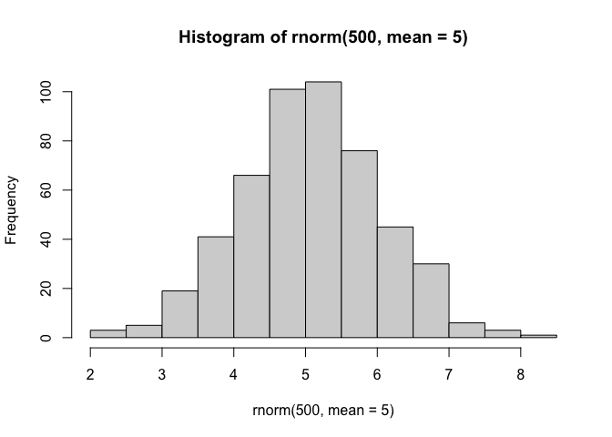

``` r
x <- c(rnorm(30,mean=-3),rnorm(30,mean=3))
y <- rev(x)

data <- cbind(x,y)
```

## K-means clustering

``` r
k <- kmeans(data, 2)
k
```

    K-means clustering with 2 clusters of sizes 30, 30

    Cluster means:
              x         y
    1  3.047783 -2.792467
    2 -2.792467  3.047783

    Clustering vector:
     [1] 2 2 2 2 2 2 2 2 2 2 2 2 2 2 2 2 2 2 2 2 2 2 2 2 2 2 2 2 2 2 1 1 1 1 1 1 1 1
    [39] 1 1 1 1 1 1 1 1 1 1 1 1 1 1 1 1 1 1 1 1 1 1

    Within cluster sum of squares by cluster:
    [1] 48.63525 48.63525
     (between_SS / total_SS =  91.3 %)

    Available components:

    [1] "cluster"      "centers"      "totss"        "withinss"     "tot.withinss"
    [6] "betweenss"    "size"         "iter"         "ifault"      

> Question: How many points are in each cluster?

``` r
k$size
```

    [1] 30 30

> What components of your result object details: - cluster
> assignment/membership? - cluster center?

``` r
k$cluster
```

     [1] 2 2 2 2 2 2 2 2 2 2 2 2 2 2 2 2 2 2 2 2 2 2 2 2 2 2 2 2 2 2 1 1 1 1 1 1 1 1
    [39] 1 1 1 1 1 1 1 1 1 1 1 1 1 1 1 1 1 1 1 1 1 1

``` r
k$centers
```

              x         y
    1  3.047783 -2.792467
    2 -2.792467  3.047783

> Make a clustering results figure of the data colored by cluster
> membership

``` r
plot(data, col=c("red", "blue"))
```

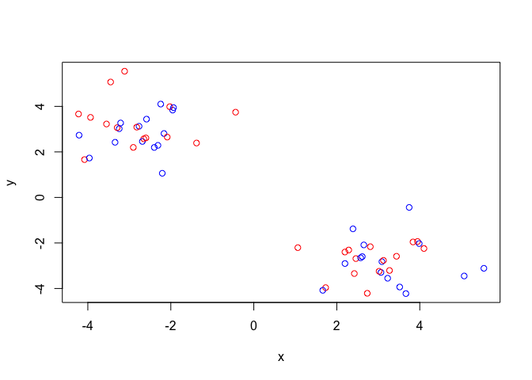

``` r
plot(data, col=k$cluster)
points(k$centers, col="royalblue", pch=20, cex=2)
```

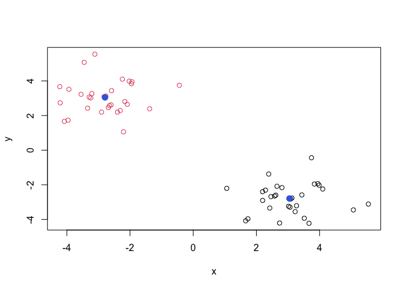

``` r
# pch is plotting character i.e. dot type
# cex is character expansion
```

K-means clustering is very popular as it is very fast and relatively
straightforward: it takes numeric data as input and return the cluster
membership, etc.

The problem is that we tell k-means how many clusters we want

> Run kmeans again and cluster it into 4 groups and plot the results
> like above

``` r
k4 <- kmeans(data, 4)
plot(data, col=k4$cluster)
points(k4$centers, col="royalblue", pch=20, cex=2)
```

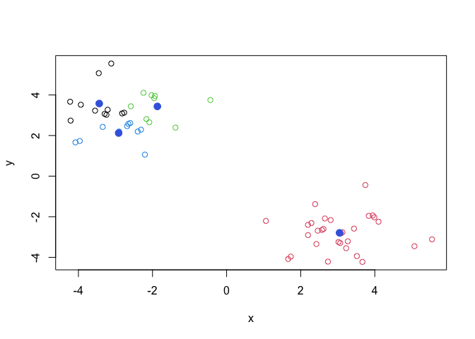

It picks lowest value of total variation within clusters. That is the
tightest fit and returns that. There is a large reduction in SS at k=2
but after that the values do not go down as quickly.

``` r
k1 <- kmeans(data, 1)
k3 <- kmeans(data, 3)
k5 <- kmeans(data, 5)

ss <- c(k1$tot.withinss, k$tot.withinss, k3$tot.withinss, k4$tot.withinss, k5$tot.withinss)
ss
```

    [1] 1120.52623   97.27049   78.94991   71.86517   64.46879

``` r
plot(ss, type="b", xlab="k", ylab="total within ss")
```

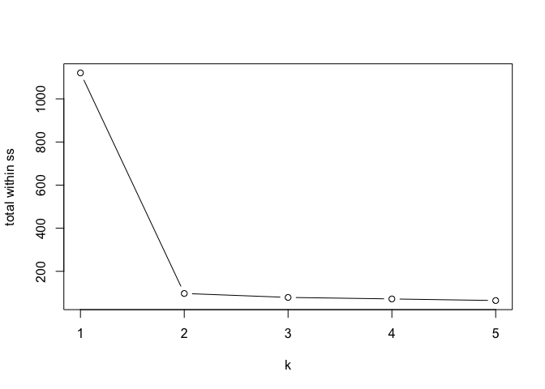

``` r
n <- NULL

for (i in 1:5)
{
  n <- c(n, kmeans(data, i)$tot.withinss)
}

plot(n, type="b")
```

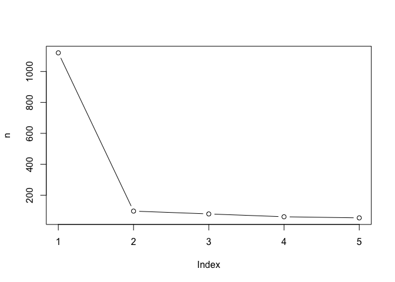

## Hierarchichal Clustering

We can’t just input our data. We need to first calculate a distance
matrix for our data (e.g. `dist()`) and use it as input for the
`hclust()` function. Not just euclidean distance but also sequence
similarity, amino acid similarity, etc.

``` r
d <- dist(data) 
# 60x60 matrix with the distance of every point in the dataset with every other point

hc <- hclust(d)
hc
```


    Call:
    hclust(d = d)

    Cluster method   : complete 
    Distance         : euclidean 
    Number of objects: 60 

There is a plot method for hclust results

``` r
plot(hc)
abline(h=8, col="red")
```

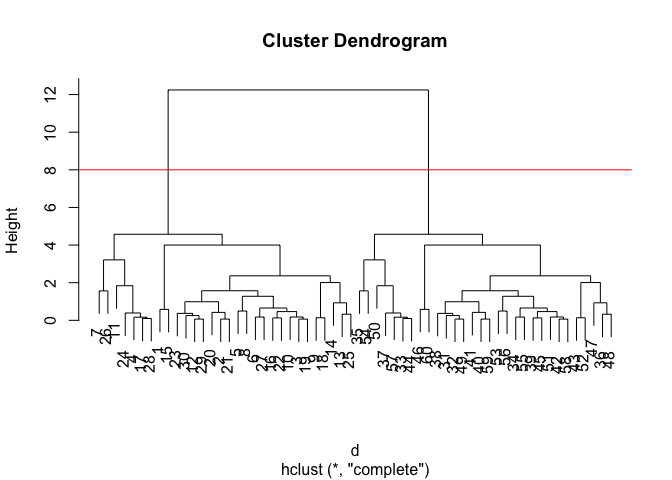

The numbers between 1-30 and 31-60 are on separate sides of the graphs
i.e. they are highly separated by distance.

To get our cluster membership vector (i.e. our main clustering result)
we can “cut” the tree at a given height or a height that yields a given
“k” number of groups.

``` r
hccol <- cutree(hc, h=8)
```

> Plot the data with our hclust result coloring

``` r
plot(data, col=hccol)
```

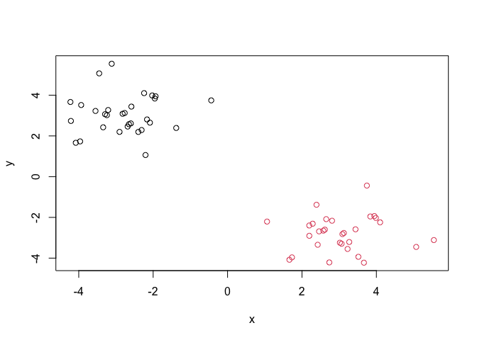

## Principal Component Analysis

### PCA of UK food data

``` r
url <- "https://tinyurl.com/UK-foods"
food <- read.csv(url, row.names=1)
dim(food)
```

    [1] 17  4

``` r
head(food)
```

                   England Wales Scotland N.Ireland
    Cheese             105   103      103        66
    Carcass_meat       245   227      242       267
    Other_meat         685   803      750       586
    Fish               147   160      122        93
    Fats_and_oils      193   235      184       209
    Sugars             156   175      147       139

``` r
# rownames(food) <- food [,1]
# food <- food[,-1]
# food

# Can get disruptive if run again (keeps removing columns)
```

Some base figures

``` r
barplot(as.matrix(food), beside=T, col=rainbow(nrow(food)))
```


``` r
barplot(as.matrix(food), beside=F, col=rainbow(nrow(food)))
```


There is one plot that can be useful for small datasets

``` r
pairs(food, col=rainbow(10), pch=16)
```

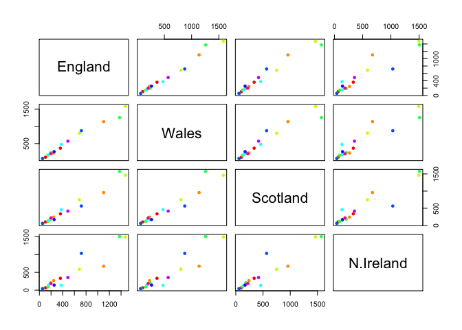

> It can be challengin to spot major trends and patters even in
> relatively small multivariate datasets (here we have 17, typically we
> have 1000s)

### PCA

In base R, the main PCA function is `prcomp()`

I will take the transpose of our food data so the “foods” are in the
columns

``` r
pca <- prcomp(t(food))
summary(pca)
```

    Importance of components:
                                PC1      PC2      PC3     PC4
    Standard deviation     324.1502 212.7478 73.87622 2.7e-14
    Proportion of Variance   0.6744   0.2905  0.03503 0.0e+00
    Cumulative Proportion    0.6744   0.9650  1.00000 1.0e+00

``` r
pca$x
```

                     PC1         PC2        PC3           PC4
    England   -144.99315   -2.532999 105.768945  1.612425e-14
    Wales     -240.52915 -224.646925 -56.475555  4.751043e-13
    Scotland   -91.86934  286.081786 -44.415495 -6.044349e-13
    N.Ireland  477.39164  -58.901862  -4.877895  1.145386e-13

``` r
cols <- c("black","red","blue","darkgreen")
plot(pca$x[,1], pca$x[,2], col=cols, pch=16, xlab="PCA1", ylab="PCA2")
```

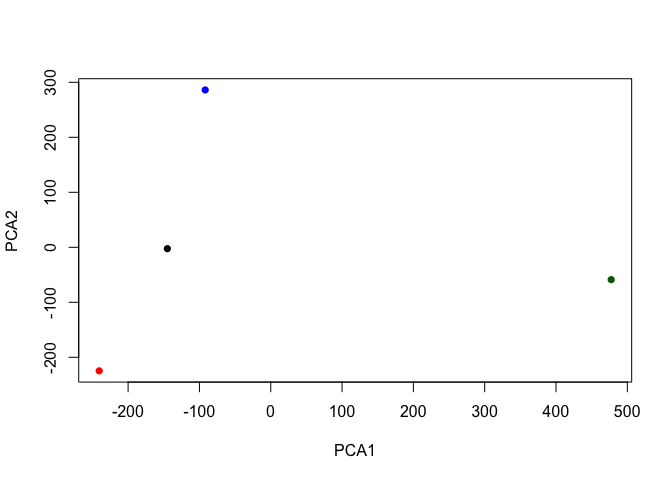

``` r
library(ggplot2)
```

``` r
ggplot(pca$x) +
  aes(PC1, PC2) +
  geom_point(col=cols) +
  theme_minimal()
```

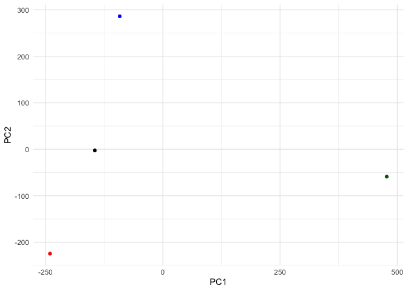

``` r
pca$rotation
```

                                 PC1          PC2         PC3          PC4
    Cheese              -0.056955380  0.016012850  0.02394295  0.739145824
    Carcass_meat         0.047927628  0.013915823  0.06367111  0.578851042
    Other_meat          -0.258916658 -0.015331138 -0.55384854 -0.084756407
    Fish                -0.084414983 -0.050754947  0.03906481  0.001282376
    Fats_and_oils       -0.005193623 -0.095388656 -0.12522257  0.012073959
    Sugars              -0.037620983 -0.043021699 -0.03605745  0.011712878
    Fresh_potatoes       0.401402060 -0.715017078 -0.20668248  0.098706764
    Fresh_Veg           -0.151849942 -0.144900268  0.21382237  0.067864113
    Other_Veg           -0.243593729 -0.225450923 -0.05332841  0.017187324
    Processed_potatoes  -0.026886233  0.042850761 -0.07364902  0.020275689
    Processed_Veg       -0.036488269 -0.045451802  0.05289191 -0.013653986
    Fresh_fruit         -0.632640898 -0.177740743  0.40012865  0.088466607
    Cereals             -0.047702858 -0.212599678 -0.35884921  0.201601167
    Beverages           -0.026187756 -0.030560542 -0.04135860 -0.004452115
    Soft_drinks          0.232244140  0.555124311 -0.16942648  0.212426744
    Alcoholic_drinks    -0.463968168  0.113536523 -0.49858320  0.032075763
    Confectionery       -0.029650201  0.005949921 -0.05232164  0.035241822

``` r
# How much each of these variables weighs on each of the axes/pcs
# Telling us what makes two countries different from each other (based on PCA results)
```

``` r
ggplot(pca$rotation) +
  aes(PC1, rownames(pca$rotation)) +
  geom_col() +
  theme_minimal()
```

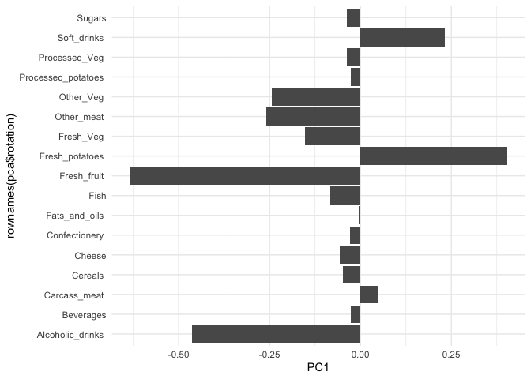
