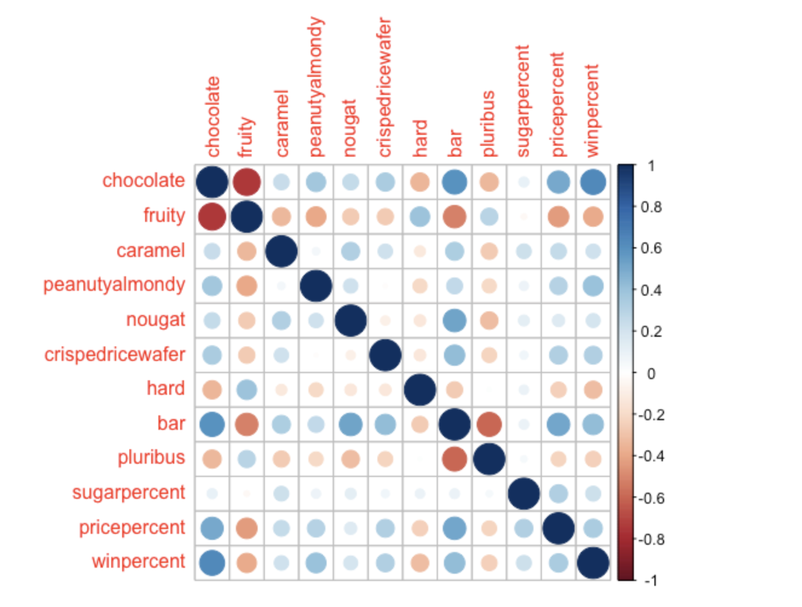

## Importing Data

```{r}
candy_file <- "candy-data.csv"

candy = read.csv(candy_file, row.names=1)
head(candy)
```


> Q1. How many different candy types are in this dataset?

```{r}
nrow(candy)
```


There are 85 different candy types in this dataset.

> Q2. How many fruity candy types are in the dataset?

```{r}
sum(candy$fruity)
```


There are 38 fruity candy types in the dataset.


## Favorite Candy

> Q3. What is your favorite candy in the dataset and what is it’s winpercent value?

```{r}
candy["Milk Duds", ]$winpercent
```


> Q4. What is the winpercent value for “Kit Kat”?

```{r}
candy["Kit Kat", ]$winpercent
```

> Q5. What is the winpercent value for “Tootsie Roll Snack Bars”?

```{r}
candy["Tootsie Roll Snack Bars", ]$winpercent
```


```{r}
library("skimr")
skim(candy)
```

> Q6. Is there any variable/column that looks to be on a different scale to the majority of the other columns in the dataset?

The sugarpercent, pricepercent and winpercent seem to be different columns since these are numeric and the rest are binary.

> Q7. What do you think a zero and one represent for the candy$chocolate column?

I think a 0 means that that candy does not contain chocolate and a 1 means that it does contain chocolate.

> Q8. Plot a histogram of winpercent values

```{r}
hist(candy$winpercent)
```


> Q9. Is the distribution of winpercent values symmetrical?

The distribution is not symmetrical.

> Q10. Is the center of the distribution above or below 50%?

The center of the distribution is below 50%.

> Q11. On average is chocolate candy higher or lower ranked than fruit candy?

```{r}
choc <- mean(candy$winpercent[as.logical(candy$chocolate)])
choc
fruit <- mean(candy$winpercent[as.logical(candy$fruity)])
fruit
```

> Q12. Is this difference statistically significant?

```{r}
t.test(candy$winpercent[as.logical(candy$chocolate)], candy$winpercent[as.logical(candy$fruity)])
```

The p-value <<< 0.05 which indicates that the difference is statistically significant.


## Overall Rankings

> Q13. What are the five least liked candy types in this set?

```{r}
head(candy[order(candy$winpercent),], n=5)
```


> Q14. What are the top 5 all time favorite candy types out of this set?

```{r}
head(candy[order(candy$winpercent, decreasing=TRUE),], n=5)
```


### Visualizing

```{r}
library(ggplot2)

ggplot(candy) + 
  aes(winpercent, rownames(candy)) +
  geom_col()
```

```{r}
ggplot(candy) + 
  aes(winpercent, reorder(rownames(candy),winpercent)) +
  geom_col()
```


```{r}
my_cols=rep("black", nrow(candy))
my_cols[as.logical(candy$chocolate)] = "chocolate"
my_cols[as.logical(candy$bar)] = "brown"
my_cols[as.logical(candy$fruity)] = "pink"
```


```{r}
ggplot(candy) + 
  aes(winpercent, reorder(rownames(candy),winpercent)) +
  geom_col(fill=my_cols) 
```

Using this plot, we can answer:

> Q17. What is the worst ranked chocolate candy?

Sixlets

> Q18. What is the best ranked fruity candy?

Starburst


## Pricepercent

```{r}
library(ggrepel)

# How about a plot of price vs win
ggplot(candy) +
  aes(winpercent, pricepercent, label=rownames(candy)) +
  geom_point(col=my_cols) + 
  geom_text_repel(col=my_cols, size=3.3, max.overlaps = 5)
```


```{r}
ord <- order(candy$pricepercent, decreasing = TRUE)
head( candy[ord,c(11,12)], n=5 )
```

> Q19. Which candy type is the highest ranked in terms of winpercent for the least money - i.e. offers the most bang for your buck?

Tootsie Roll Midgies

> Q20. What are the top 5 most expensive candy types in the dataset and of these which is the least popular?

Nik L Nip, Nestle Smarties, Ring pops, Hershey's Krackel, Hershey's Milk Chocolate.
Out of these, the Nik L Nip is the least popular.


## Correlation

```{r}
# library(corrplot)
# cij <- cor(candy)
# corrplot(cij)

# Note: I could not download the package due to version issues hence simply used the image on the lab website
```




> Q22. Examining this plot what two variables are anti-correlated (i.e. have minus values)?

Chocolate and fruity candy are anti-correlated. That is, chocolate candy is not fruity and vice versa. 

> Q23. Similarly, what two variables are most positively correlated?

Chocolate and winpercent are most positively correlated. That is, people seem to love chocolates/chocolate candy.


## Principal Component Analysis

```{r}
pca <- prcomp(candy, scale=TRUE)
summary(pca)
```

```{r}
plot(pca$x[,1:2])
```

```{r}
plot(pca$x[,1:2], col=my_cols, pch=16)
```

```{r}
# Make a new data-frame with our PCA results and candy data
my_data <- cbind(candy, pca$x[,1:3])
```


```{r}
p <- ggplot(my_data) + 
        aes(x=PC1, y=PC2, 
            size=winpercent/100,  
            text=rownames(my_data),
            label=rownames(my_data)) +
        geom_point(col=my_cols)

p
```


```{r}
library(ggrepel)

p + geom_text_repel(size=3.3, col=my_cols, max.overlaps = 7)  + 
  theme(legend.position = "none") +
  labs(title="Halloween Candy PCA Space",
       subtitle="Colored by type: chocolate bar (dark brown), chocolate other (light brown), fruity (red), other (black)",
       caption="Data from 538")
```


```{r}
library(plotly)
```

```{r}
ggplotly(p)
```


```{r}
par(mar=c(8,4,2,2))
barplot(pca$rotation[,1], las=2, ylab="PC1 Contribution")
```


> Q24. What original variables are picked up strongly by PC1 in the positive direction? Do these make sense to you?

Fruity, hard and pluribus are strongly picked up by PC1 in the positive direction.
Yes, these make sense to me since they are correlated.