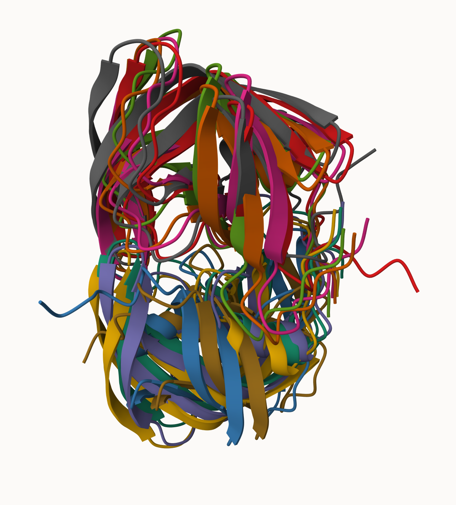
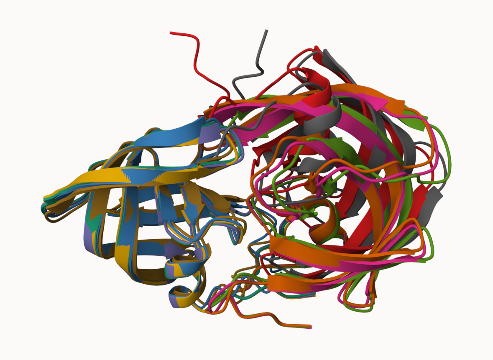
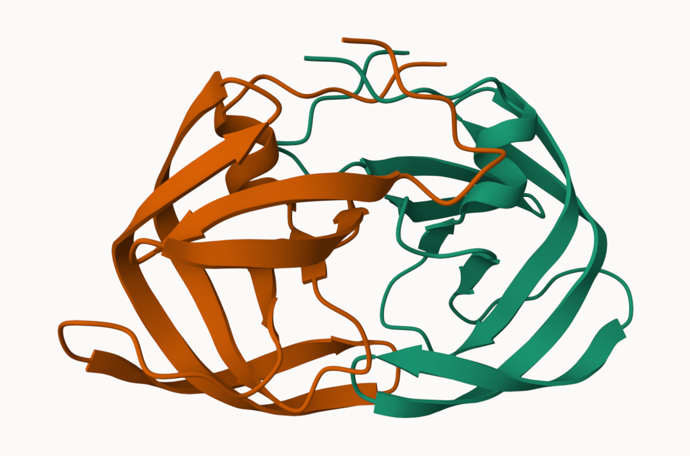
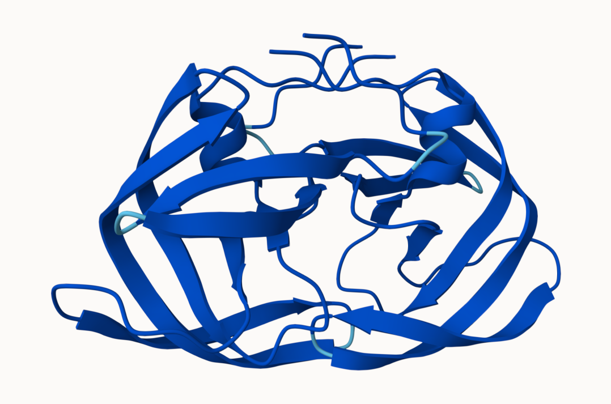
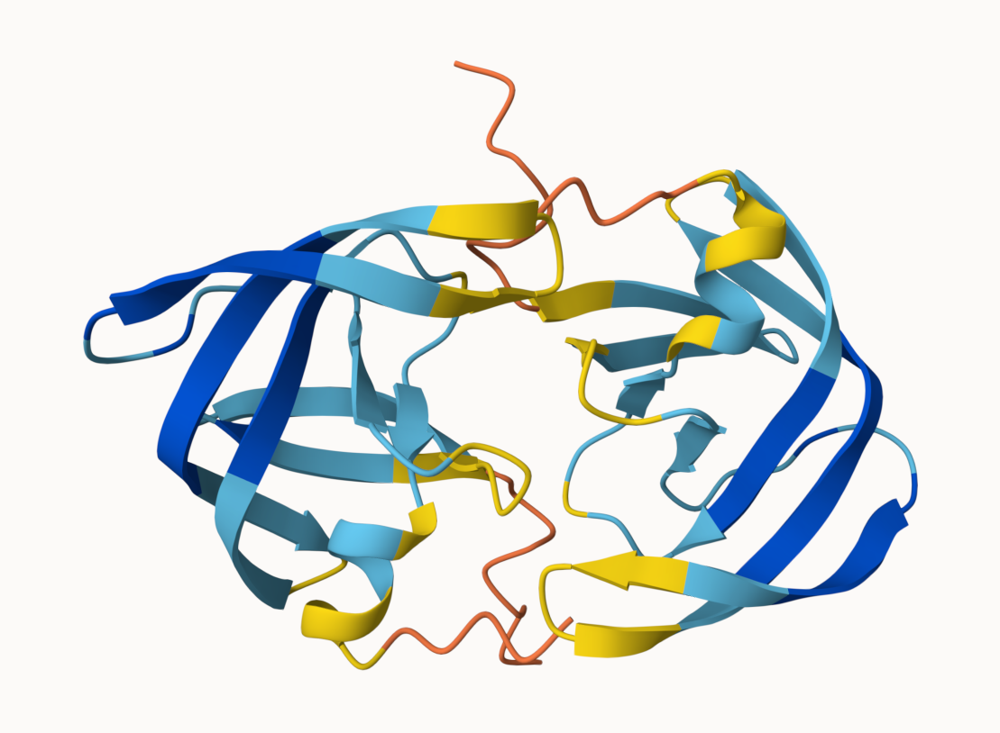
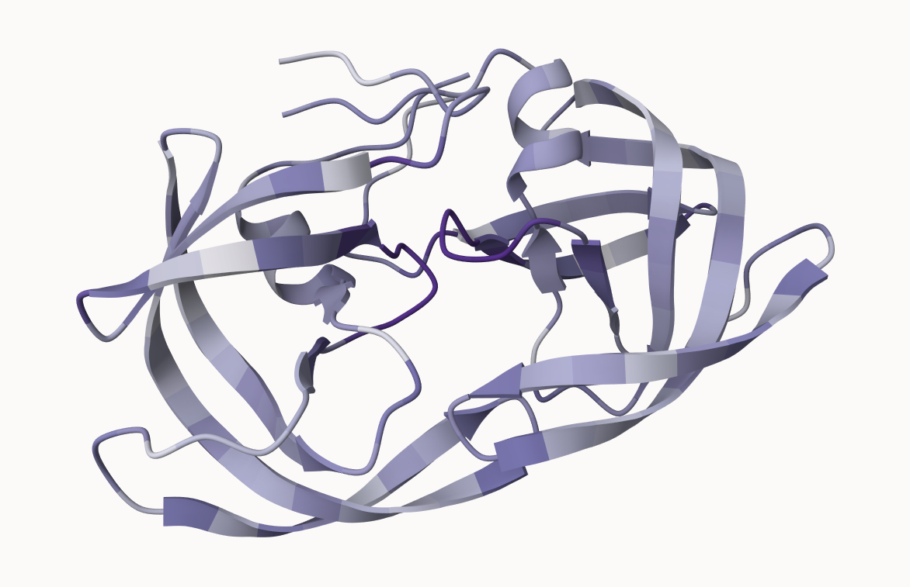

The EBI maintains the largest database of AlphaFold structure prediction models

The PDB has around 244,290 protein structures
The total number of protein sequences in UniProtKB is 199,579,901

```{r}
(244290/199579901) *100
```

That means, about 0.1% of protein structures have been obtained/predicted
Structure prediction on average is way more time and money consuming


## AlphaFold Database (AFDB)

We searched for the following sequence under the database:

HIV-Pr
PQITLWQRPLVTIKIGGQLKEALLDTGADDTVLEEMSLPGRWKPKMIGGIGGFIKVRQYDQILIEICGHKAIGTVLVGPTPVNIIGRNLLTQIGCTLNF

The top hit was named “Peptidase A2 domain-containing protein” from Thalassobius mangrovi.

There are two "Quality Scores" from AlphaFold. One for residues, (i.e. each amino acid) called pLDDT score, which measures confidence in structure prediction. The other is the PAE score which measures the confidence in the relative position of the two residues. 


## Generating your own structure predictions

Figure of 5 generated HIV-Pr models



Figure of all 5 generated HIV-Pr models after superposition



This is the top ranked model colored by chain



This is the top ranked model colored by pLDDT confidence




This is the lowest ranked model colored by pLDDT confidence




## Custom analysis of resulting models

Read key result files into R.

```{r}
# Change this for YOUR results dir name
results_dir <- "HIVPRDimer_23119/" 

# File names for all PDB models
pdb_files <- list.files(path=results_dir,
                        pattern="*.pdb",
                        full.names = TRUE)

# Print our PDB file names
basename(pdb_files)
```

```{r}
library(bio3d)

# Read all data from Models 
#  and superpose/fit coords
pdbs <- pdbaln(pdb_files, fit=TRUE, exefile="msa")
```

```{r}
pdbs
```

```{r}
rd <- rmsd(pdbs, fit=T)
rd
```

```{r}
library(pheatmap)

colnames(rd) <- paste0("m",1:5)
rownames(rd) <- paste0("m",1:5)
pheatmap(rd)
```


```{r}
plotb3(pdbs$b[1,], typ="l", lwd=2, sse=pdb)
points(pdbs$b[2,], typ="l", col="red")
points(pdbs$b[3,], typ="l", col="blue")
points(pdbs$b[4,], typ="l", col="darkgreen")
points(pdbs$b[5,], typ="l", col="orange")
abline(v=100, col="gray")
```


```{r}
core <- core.find(pdbs)
core.inds <- print(core, vol=0.5)
xyz <- pdbfit(pdbs, core.inds, outpath="corefit_structures")
```

```{r}
rf <- rmsf(xyz)

plotb3(rf, sse=pdb)
abline(v=100, col="gray", ylab="RMSF")
```


```{r}
m1 <- read.pdb(pdb_files[1])
m1
```

```{r}
m1$atom
```

Column b has pLDDT confidence scores

```{r}
plot.bio3d(m1$atom$b[m1$calpha], typ="l", ylim=c(80,100))
```


### Residue conservation from alignment file


```{r}
aln_file <- list.files(path=results_dir,
                       pattern=".a3m$",
                        full.names = TRUE)
aln_file
```


```{r}
aln <- read.fasta(aln_file[1], to.upper = TRUE)
dim(aln$ali)
```


```{r}
sim <- conserv(aln)
pdb <- read.pdb("1hsg")

plotb3(sim[1:99], sse=trim.pdb(pdb, chain="A"),
       ylab="Conservation Score")
```


```{r}
con <- consensus(aln, cutoff = 0.9)
con$seq
```

```{r}
con <- consensus(aln, cutoff = 0.8)
con$seq
```


```{r}
m1.pdb <- read.pdb(pdb_files[1])
occ <- vec2resno(c(sim[1:99], sim[1:99]), m1.pdb$atom$resno)
write.pdb(m1.pdb, o=occ, file="m1_conserv.pdb")
```


Here is the m1_conserv.pdb file with the residues colored by occupancy




